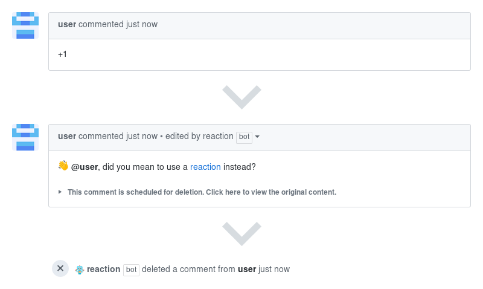

# Reaction Comments

Reaction Comments is a GitHub App built with [Probot](https://github.com/probot/probot)
that teaches users about the correct use of GitHub reactions,
and deletes *new* reaction comments, such as +1.



## Supporting the Project

The continued development of Reaction Comments is made possible
thanks to the support of awesome backers. If you'd like to join them,
please consider contributing with [Patreon](https://goo.gl/qRhKSW),
[PayPal](https://goo.gl/5FnBaw) or [Bitcoin](https://goo.gl/uJUAaU).

## How It Works

The app detects if a new comment consists solely of emojis and shortcodes
used in GitHub reactions. A matching comment is either replaced
with the message set in `reactionComment` and deleted after a day,
or it is deleted immediately, if `reactionComment` is set to `false`.

## Usage

1. **[Install the GitHub App](https://github.com/apps/reaction)**
   for the required repositories
2. Create `.github/reaction.yml` based on the template below

#### Configuration

Create `.github/reaction.yml` in the default branch to enable the app.
The file can be empty, or it can override any of these default settings:

```yaml
# Configuration for reaction-comments - https://github.com/dessant/reaction-comments

# Issues and pull requests with these labels accept reaction comments.
# Set to `[]` to disable
exemptLabels: []

# Replace matching comments with this message, `{user}` is a placeholder
# for the comment author. Set to `false` to disable
reactionComment: >
  :wave: @{user}, did you mean to use a [reaction](https://git.io/vhzhC) instead?

# Limit to only `issues` or `pulls`
# only: issues

# Optionally, specify configuration settings just for `issues` or `pulls`
# issues:
#   exemptLabels:
#     - party-parrot

# pulls:
#   reactionComment: false

# Repository to extend settings from
# _extends: repo
```

## Deployment

See [docs/deploy.md](docs/deploy.md) if you would like to run your own
instance of this app.

## License

Reaction Comments is released under the terms of the MIT License.
Please refer to the [LICENSE](LICENSE) file.
